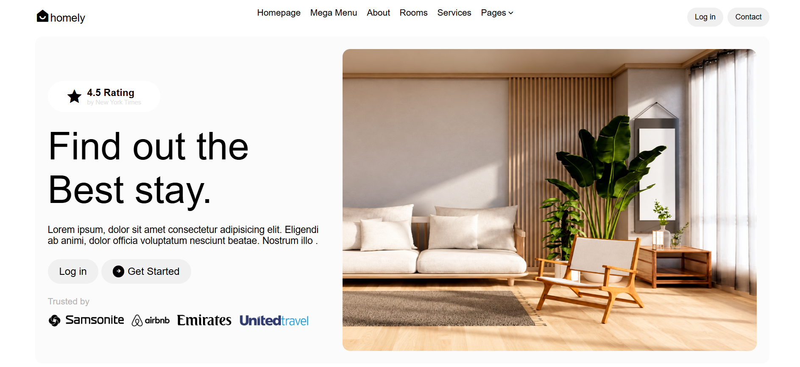

🚀 **Live Demo:** [View Live Project](https://practice-projects-homely-website-cl.vercel.app/)

## 🖼️ Preview

---

# 🏡 Homely — Real Estate & Accommodation UI Recreation

## 📌 Project Overview

A frontend UI recreation built with HTML5 and CSS3, inspired by a modern real-estate and accommodation layout. It includes navigation, hero content, property cards, pricing, amenities, and booking-focused sections.

## 🎯 Project Objective

This project focuses on strengthening core frontend skills through Flexbox, spacing, sizing, positioning, background images, typography, hover effects, transitions, and visual composition.

## 🛠️ Technologies Used

* **HTML5** — Page structure and semantic organization
* **CSS3** — Styling, layout, spacing, and visual presentation
* **Flexbox** — Navigation, hero, cards, and content alignment
* **CSS calc()** — Dynamic section sizing
* **Background Images** — Property and accommodation visuals
* **Remix Icon** — Navigation, rating, arrows, and amenity icons
* **PNG / Image Assets** — Branding and property imagery
* **Unsplash Images** — Accommodation photographs

## 📊 Project Metrics

* 1 HTML document and 1 CSS stylesheet
* 5 major content sections
* 6 navigation links and 2 hero action buttons
* 2 accommodation preview cards
* 4 accommodation category filters
* 2 property-detail blocks
* 45px navigation height
* 60px hero heading and 70px accommodation heading
* 25px card gap and 20px hero content gap

## 🧩 Key CSS Concepts

* Flexbox and flexible sizing with `flex`
* `calc()` for dynamic section height
* Background sizing and positioning
* Relative and absolut
